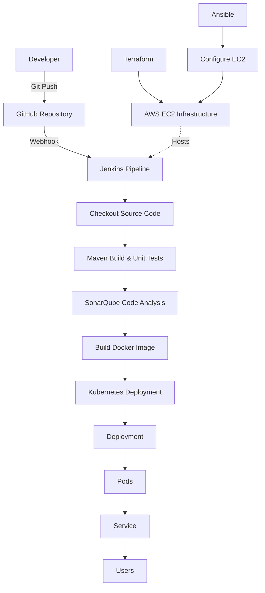

# DevSecOps Pipeline Architecture

```mermaid
flowchart TD

A[Developer] -->|Git Push| B[GitHub Repository]

B -->|Webhook| C[Jenkins Pipeline]

C --> D[Checkout Source Code]
D --> E[Maven Build & Unit Tests]
E --> F[SonarQube Code Analysis]
F --> G[Build Docker Image]

G --> H[Kubernetes Deployment]

H --> I[Deployment]
I --> J[Pods]
J --> K[Service]
K --> L[Users]

M[Terraform] --> N[AWS EC2 Infrastructure]

O[Ansible] --> P[Configure EC2]
P --> N

N -. Hosts .-> C
```